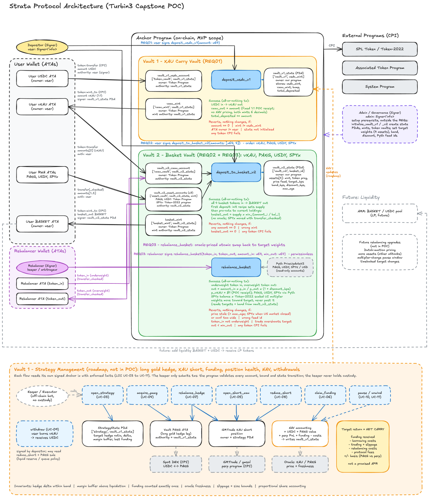

# Architecture and documentation

- [Final group architecture and requirements](architecture-and-requirements.pdf)
- [Architecture diagram](architecture-diagram.png)

The PDF is the agreed design baseline. The standalone diagram supports the same three POC requirements: REQ01 deposit USDC, REQ02 deposit the four basket assets, and REQ03 rebalance the basket.

Record refinements in a future `decisions.md`, including initial basket issuance, integer rounding, deposit ratios, oracle configuration, and POC vXAU valuation. Keep the PDF, diagram, requirements, and implementation aligned when changes are approved.
